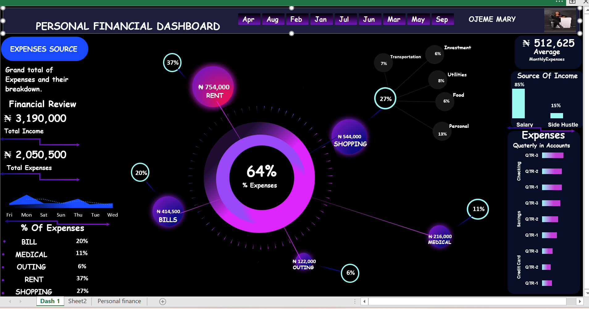
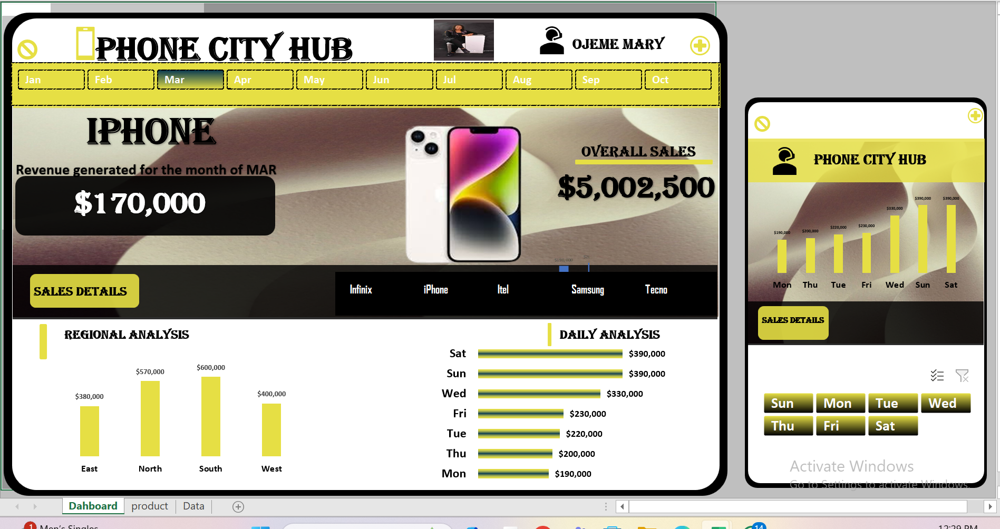

## ABOUT ME

Hello Everyone! I am Ojeme Mary 🤓, a data analyst, educator, and consultant with a passion for turning data into actionable insights. With experience across sales, operations, finance, and customer service, I help businesses solve challenges and unlock growth.

## WHAT I DO

*A data analyst instructor with Skillahead Academy, I provide consulting and training services for businesses and i am also a Freelance Data Analyst.*

**- ✅  **Data Analysis Expertise**: Proficient in Excel and Power BI for creating impactful dashboards, performing advanced data wrangling, and delivering actionable business insights.  

**- ✅  **Mentorship and Community Building**: Dedicated to empowering aspiring data analysts through mentorship, training, and fostering collaborative communities like *Data Divas Hub.  

**- ✅ **Adaptability and Growth**: Thrives on continuous learning and skill development, transitioning from an education background to excelling in data analytics and thriving in remote roles. 

<!--Section 2: List 3-4 key projects-->
## MY PORTFOLIO 

*A glimpse of some of the projects I've been working on.*

**Personal Financial Analysis.**

Keeping tract of your monthly expenses is very important.Do you want to know where your money is going into?

[Read More](https://www.linkedin.com/posts/maryojeme_excelmagic-personalfinance-moneymanagement-activity-7255620693294297089-V22c?utm_source=share&utm_medium=member_desktop)

**Predictive Modeling and Hypothesis Testing using Titanic Dataset.**

On April 15, 1912, during her maiden voyage, the widely considered “unsinkable” RMS Titanic sank after colliding with an iceberg. 

[Read More](https://www.linkedin.com/pulse/predictive-modeling-hypothesis-testing-using-titanic-dataset-anietie/)

**Predictive Modeling and Hypothesis Testing using Titanic Dataset.**

Unfortunately, there weren’t enough lifeboats for everyone onboard, resulting in the death of 1502 out of 2224 passengers and crew. 

[Read More](https://www.linkedin.com/pulse/predictive-modeling-hypothesis-testing-using-titanic-dataset-anietie/)

## MY CLASSES

*Call my admin for details about the classes: 08034730987.*

- Settings | One-on-One, Group, Communities.								       		
- Platforms	| Physical or Virtual, Weekday or Weekend. 			        		
- Courses | Advanced Excel, Statistics, Power BI, SQL, Tableau, Python.

<!--Section 3: This section is optional. You can replace this section with a list of your core skills-->
## MY COURSES
*You can get these courses today.*

**Performance Analysis**

Advanced Data Analytics: Mastering the Craft with Portfolio Project using Excel. Master data analytics by solving real-world sales problems using MS Excel 2021, learn core dashboard design and presentation skills and create your portfolio project. This course is designed for beginners and professional data analyst.

[Get this course](https://selar.co/salesdata)

**Attrition Analysis**

In this course, you will learn how to analyze HR and employee data, including demographics, job roles, performance metrics, and workplace satisfaction, to identify the underlying causes and predictors of employee attrition.

[Get this course](https://selar.co/q688i7)

## CONTACT DETAILS

*Let’s connect and see how we can make a difference together!*
<table>
  <tbody>
    <tr>
      <td>📧</td>
      <td><a href="mailto:ojeme0610@gmail.com">ojeme0610@gmail.com</a></td>
    </tr>
    <tr>
      <td>📞</td>
      <td>(234) 705-83-57237</td>
    </tr>
    <tr>
      <td>📍</td>
      <td>Lagos, Nigeria</td>
    </tr>
    <tr>
      <td>⬇️</td>
      <td><a href="https://etuk123456.github.io/portfolio1/docs/Profile.pdf">Download my CV</a></td>
    </tr>
    <tr>
      <td>🌐</td>
      <td><a href="https://https://www.linkedin.com/in/maryojeme/">The things I do daily on LinkedIn</a></td>
    </tr>
    <tr>
      <td>📺</td>
      <td><a href="https://https://www.youtube.com/@OjemeMary">Watch my tutorials on YouTube</a></td>
    </tr>
  </tbody>
</table>

   

